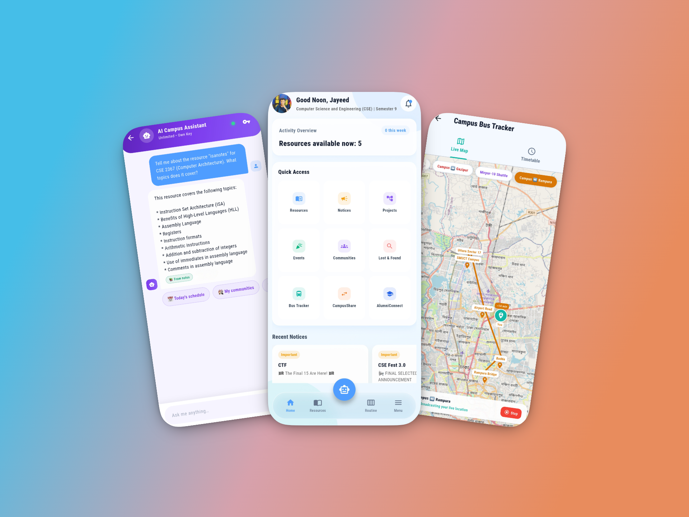
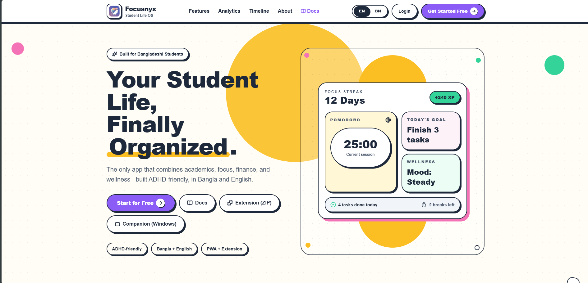
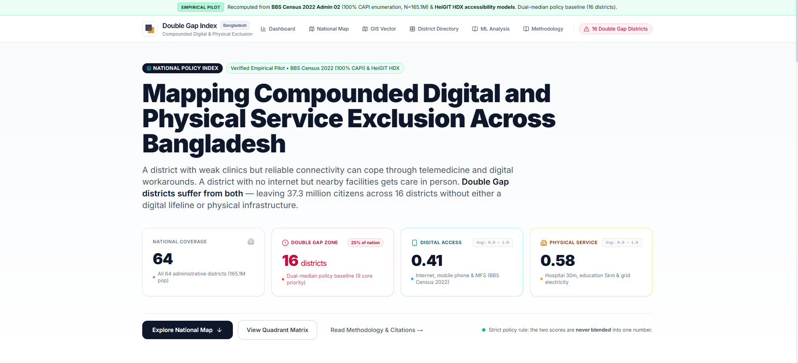
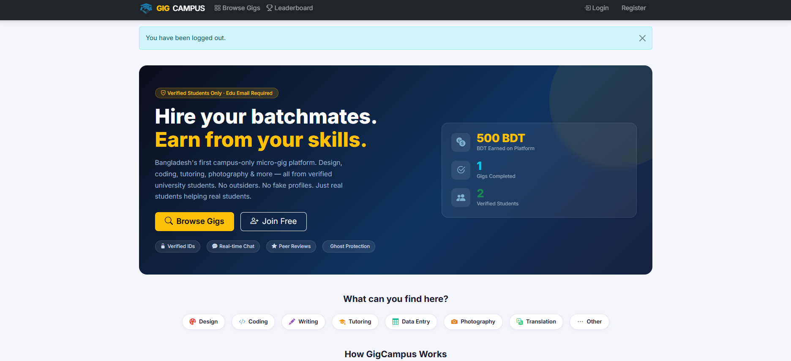
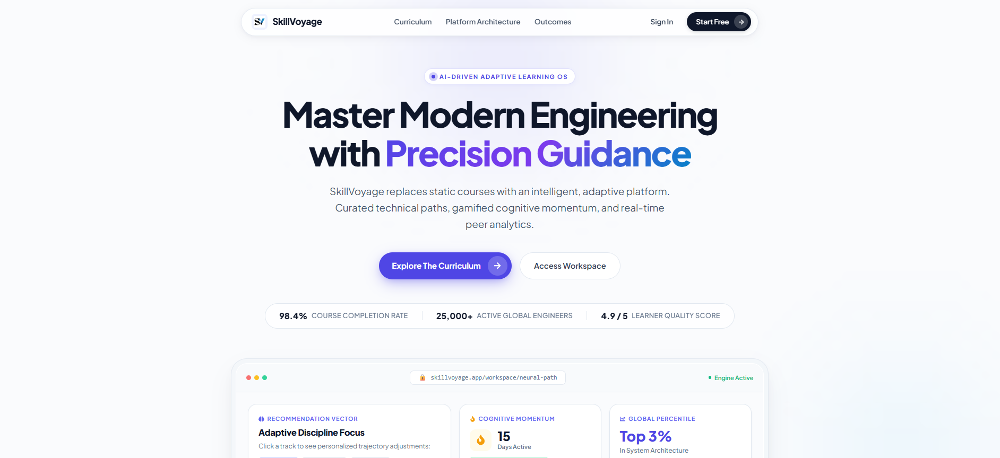
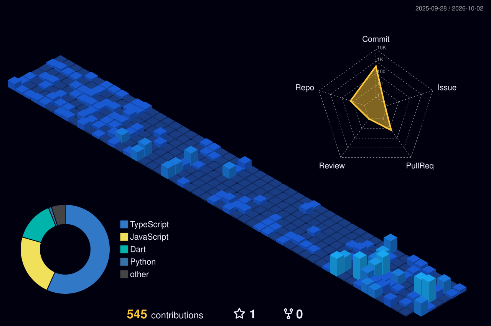

<!-- ████████████████████████████████████████████████████████████████████████ -->
<!-- HERO BANNER — animated hello video                                        -->
<!-- ████████████████████████████████████████████████████████████████████████ -->

<!-- TYPING ROLES (Synchronized with portfolio jayeed.pro.bd) -->

 

<!-- VERIFIED METRICS BAR -->

  
  
  
  

---

## 🕷️ About Me

  

👋 **Hey! I'm S. M. Mehrab Hossain Jayeed** — a Full-Stack &amp; Mobile Engineer specializing in high-velocity MVP execution. I bridge clean interface design with hardened backend architectures, helping founders and engineering teams build products that look refined and scale cleanly.

- 📱 **Mobile Engineering** — Crafting fluid 60/120fps cross-platform apps with **Flutter &amp; Dart**, backed by Supabase Realtime, offline SQLite caching, and live GPS routing.
- ⚡ **Full-Stack Systems** — Shipping high-performance web applications using **React, Next.js, and TypeScript**, backed by PostgreSQL schemas, Row-Level Security (RLS), and RESTful APIs.
- 🧠 **AI &amp; RAG Workflows** — Designing custom vector search pipelines (**Supabase pgvector**), high-throughput **Groq LLM** integrations, and empirical machine learning models.
- 🎓 **Academics** — Final-year B.Sc. in Computer Science &amp; Engineering at **Shanto-Mariam University of Creative Technology** (Dhaka, Bangladesh 🇧🇩).

*"With great compute power comes great responsibility."* — I work genuinely best under pressure `:3`

---

## 🪪 Developer ID &amp; Mission Control

  

---

## 🛠️ Technical Arsenal

  

 

**Core Languages**

**Mobile &amp; Frontend**

**Backend &amp; Databases**

**AI, Data &amp; Cloud Tools**

---

## ✦ Featured Flagships &amp; Projects ✦

<!-- ═══════════════════════════════════════════════════════════ -->
### 📱 UniShareSync — University Collaboration &amp; Campus Ecosystem
<!-- ═══════════════════════════════════════════════════════════ -->

  

Unified university mobile ecosystem connecting students, faculty, and administration. Features an AI Campus Assistant with citation-backed document RAG querying, real-time collaborative Kanban whiteboards, live bus transit tracking via OpenStreetMap, and trust-scored peer commerce.

- 🤖 **Groq RAG AI Assistant** — Vector-grounded semantic search over academic course notes via Supabase pgvector.
- 🗺️ **Live Campus Transit** — Real-time bus GPS tracking with OpenStreetMap and automated route timetables.
- 🔄 **Real-Time Workspace** — Collaborative whiteboards and Kanban sync via Supabase Realtime webhooks.

**Tech Stack:** `Flutter` · `Dart` · `Supabase` · `pgvector` · `Groq API` · `FCM` · `OpenStreetMap`

  
  

 

<!-- ═══════════════════════════════════════════════════════════ -->
### 🎯 Focusnyx — Student Life OS &amp; Cognitive Shield
<!-- ═══════════════════════════════════════════════════════════ -->

  

Full-stack student productivity ecosystem and cognitive shield designed for neurodivergent learners. Combines a Next.js 14 web app with a Chrome MV3 distraction blocker, native Windows Win32 focus enforcement hooks, and bilingual AI behavioral coaching.

- 🔒 **Cross-Surface Focus Lockdown** — Real-time focus sync between web PWA, browser extension, and desktop hooks.
- 🤖 **AI Behavioral Coach** — Context-aware bilingual (English/Bangla) study coach and automated quiz generation.
- 📊 **Academic Momentum** — 3-tier analytics dashboard with progress tracking and study streak metrics.

**Tech Stack:** `Next.js 14` · `TypeScript` · `Supabase` · `Chrome MV3` · `Win32 Hooks` · `Groq API`

  
  

 

<!-- ═══════════════════════════════════════════════════════════ -->
### 📊 Double Gap Index (DGI) — Policy Intelligence Platform
<!-- ═══════════════════════════════════════════════════════════ -->

> 🔬 **Empirical Policy AI · 64 Districts Coverage**

  

Interpretable policy intelligence dashboard scoring compounded digital-access and physical-service-access gaps across all 64 districts of Bangladesh. Employs K-Means clustering and SHAP feature attribution to identify 37 critical double-gap districts.

- 🗺️ **Interactive Vector GIS** — High-speed MapLibre GL choropleth maps with 2x2 quadrant policy matrices.
- 🔬 **Explainable Machine Learning** — Unsupervised clustering paired with SHAP attributions explaining district scores.
- 🏗️ **Robust Data Pipeline** — Automated Python ETL normalizing BBS survey data across 7 socio-economic indicators.

**Tech Stack:** `Next.js 15` · `Python ETL & ML` · `MapLibre GL` · `Scikit-learn` · `SHAP` · `Supabase`

  
  

 

<!-- ═══════════════════════════════════════════════════════════ -->
### 🎓 GigCampus — Campus Micro-Task Marketplace
<!-- ═══════════════════════════════════════════════════════════ -->

> ⚡ **CS50x Capstone Project**

  

Peer-to-peer campus marketplace where verified university students hire batchmates for freelance skills in design, software development, tutoring, and translation. Built to eliminate scams and unverified third-party freelancers.

- 🔐 **Verified Edu-Auth** — Strict institutional email authentication ensuring 100% student-only community.
- 💬 **Live Communications** — Low-latency Socket.IO messaging with order status tracking and dispute mitigation.
- 🛡️ **Ghost Protection** — Milestone-based order lifecycles and peer ratings protecting both buyer and seller.

**Tech Stack:** `React` · `Node.js` · `Express.js` · `MongoDB` · `Socket.IO` · `TailwindCSS`

  
  

 

<!-- ═══════════════════════════════════════════════════════════ -->
### 🧭 SkillVoyage — Adaptive Learning &amp; Curriculum Engine
<!-- ═══════════════════════════════════════════════════════════ -->

  

AI-driven curriculum architecture platform providing precision guidance, cognitive momentum tracking, and interactive tech career progression roadmaps for software engineers.

- 📈 **Dynamic Milestones** — Interactive developer roadmaps with curriculum checklists and self-assessment scoring.
- 🔐 **Hardened Architecture** — JWT-secured session management, MongoDB indexing, and high-throughput REST APIs.
- 🎯 **Curated Guidance** — Automated skill trajectory recommendations based on developer career aspirations.

**Tech Stack:** `React` · `Node.js` · `Express.js` · `MongoDB` · `JWT Auth` · `TailwindCSS`

  
  

 

<b>📂 View More Repositories &amp; Engineering Systems (9+ Projects)</b>

 

| Project | Description | Stack | Links |
| :--- | :--- | :--- | :--- |
| **[UniShareSync Mobile](https://github.com/mhjayeed715/UniShareSync-Mobile-App)** | Campus ecosystem with Groq RAG AI &amp; transit tracking | Flutter, Supabase, Groq | [Code](https://github.com/mhjayeed715/UniShareSync-Mobile-App) · [Live](https://unisharesync.vercel.app/) |
| **[Focusnyx](https://github.com/mhjayeed715/Focusnyx)** | Student Life OS — PWA, MV3 extension &amp; desktop hooks | Next.js 14, Supabase, Groq | [Code](https://github.com/mhjayeed715/Focusnyx) · [Live](https://focusnyx.vercel.app/) |
| **[Double-Gap-Index-DGI](https://github.com/mhjayeed715/Double-Gap-Index-DGI)** | Policy Intelligence &amp; GIS scoring across 64 districts | Next.js, Python, SHAP | [Code](https://github.com/mhjayeed715/Double-Gap-Index-DGI) · [Live](https://doublegapindex.vercel.app/) |
| **[GigCampus](https://github.com/mhjayeed715/GigCampus)** | Peer-to-peer campus micro-task marketplace | React, Express, MongoDB | [Code](https://github.com/mhjayeed715/GigCampus) · [Live](https://gigcampus-7er7.onrender.com/) |
| **[SkillVoyage](https://github.com/mhjayeed715/skillvoyage)** | Adaptive skill roadmaps &amp; goal tracker | React, Express, MongoDB | [Code](https://github.com/mhjayeed715/skillvoyage) · [Live](https://skillvoyageweb.vercel.app/) |
| **[Servyn](https://github.com/mhjayeed715/servyn)** | On-demand local service booking mobile app with OTP | Flutter, Dart, Supabase | [Code](https://github.com/mhjayeed715/servyn) |
| **[AI Drainage Optimizer](https://github.com/mhjayeed715/AI-Powered-Smart-Waterlogging-and-Drainage-Optimizer)** | Machine learning for predictive urban flooding analytics | Python, ML, Pandas | [Code](https://github.com/mhjayeed715/AI-Powered-Smart-Waterlogging-and-Drainage-Optimizer) |
| **[UniShareSyncFX](https://github.com/mhjayeed715/UniShareSyncFX)** | Desktop resource client with MySQL replication | Java, JavaFX, MySQL | [Code](https://github.com/mhjayeed715/UniShareSyncFX) |
| **[Portfolio Flagship](https://github.com/mhjayeed715/portfolio)** | Personal flagship portfolio with dynamic CMS | React, Vite, Tailwind | [Code](https://github.com/mhjayeed715/portfolio) · [Live](https://jayeed.pro.bd) |

---

## ✦ Open Source Contributions

| Repository | Role | Impact &amp; Contributions |
| :--- | :--- | :--- |
| 🏥 **[OpenMed](https://github.com/mhjayeed715/openmed)** | Contributor | Contributed to privacy-first clinical NLP doing Named Entity Recognition (NER) &amp; HIPAA de-identification via Python and Apple MLX. |
| 💻 **[Personal OS](https://github.com/mhjayeed715/personal-os)** | Contributor | Improved modular digital headquarters architecture for open-source personal life OS systems. |

---

## 🏙️ GitHub Activity &amp; Commit Telemetry

  

<picture>
  <source media="(prefers-color-scheme: dark)" srcset="https://raw.githubusercontent.com/platane/snk/output/github-contribution-grid-snake-dark.svg"/>
  <source media="(prefers-color-scheme: light)" srcset="https://raw.githubusercontent.com/platane/snk/output/github-contribution-grid-snake.svg"/>
  
</picture>

---

## ⚡ GitHub Statistics &amp; Milestones

<!-- ACHIEVEMENTS & TROPHIES -->

  

  
  

  

---

## 🤝 Let's Connect &amp; Build Something Extraordinary!

  Whether you're looking to build <b>high-velocity mobile MVPs</b> in Flutter, scale <b>full-stack web platforms</b> in React/Next.js, integrate <b>AI &amp; RAG search pipelines</b>, or debate Spider-Man lore — my inbox is always open 🕸️

  

  

  <i>"Turning early-stage ideas into dependable, fluid, and scalable products that are ready to launch."</i>
   
  ⚡ Designed &amp; Engineered with precision by <b>S. M. Mehrab Hossain Jayeed</b> · Dhaka, Bangladesh 🇧🇩

