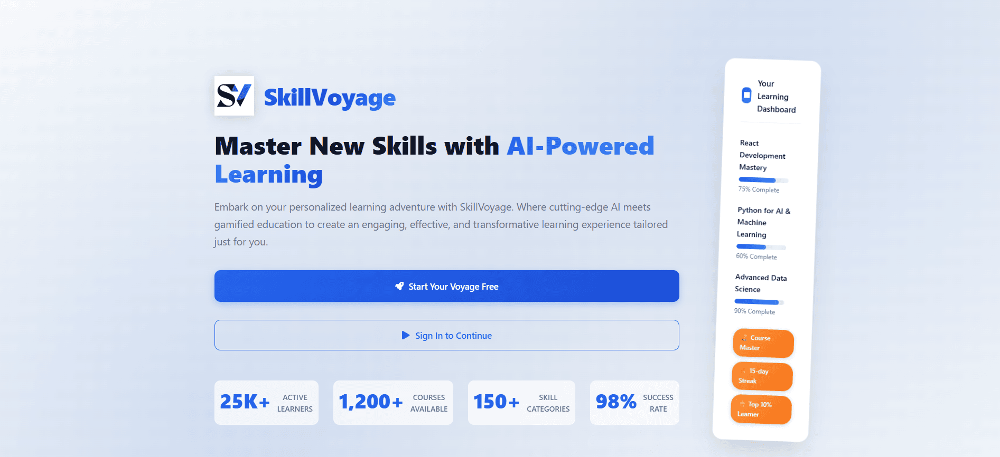

<!-- ████████████████████████████████████████████████████████████████████████ -->
<!-- HERO BANNER — animated hello video                                        -->
<!-- ████████████████████████████████████████████████████████████████████████ -->

<!-- TYPING GREETING -->

 

---

## 🕷️ About Me

<table width="100%" style="border: none; background: transparent;">
<tr>
<td width="68%" valign="top" style="border: none; padding-right: 16px;">

🎓 **Final-year CSE student** @ Shanto-Mariam University of Creative Technology

🤖 **Currently building in AI/ML/CV** — LLM integrations, RAG pipelines, Agentic AI systems, and Computer Vision prototypes using Python, Groq, Gemini APIs, and Supabase/pgvector.

📱 **Full-Stack Mobile Engineer** — crafting fluid 60/120fps Flutter apps with AI-powered assistants, real-time Supabase sync, and live GPS features.

⚡ **Web Craftsman** — shipping production-grade React/Next.js + TypeScript apps backed by Supabase PostgreSQL, REST APIs, and GitHub Actions CI/CD.

🕸 *"With great compute power comes great responsibility."* — I work genuinely best under pressure `:3`

</td>
<td width="32%" align="center" valign="middle" style="border: none;">

📍 **Khilkhet, Dhaka, Bangladesh** 🇧🇩

</td>
</tr>
</table>

---

## 🪪 Developer ID & Mission Control

  

---

## 🧠 Current Focus — AI · ML · Computer Vision

> *Final-year AI Engineer candidate actively prototyping in LLMs, RAG, Agentic AI, and Computer Vision.*

| Domain | Tools & Frameworks |
| :--- | :--- |
| **LLM & GenAI** | Groq API · Gemini API · Prompt Engineering · LangChain · Anthropic MCP |
| **RAG Pipelines** | Supabase pgvector · Vector Embeddings · Semantic Search · Citation-backed QA |
| **Data Analytics & ML** | Scikit-learn · SHAP · K-means Clustering · Feature Engineering · Pandas/NumPy |
| **Interpretable ML** | SHAP Feature Attribution · Model Evaluation · Explainable AI (XAI) |
| **Agentic AI** | AI Behavioral Agents · AI Chatbots · AI Quiz Generators · Campus AI Assistants |
| **Computer Vision** | Exploring CV pipelines · image classification · OpenCV · Python vision tooling |
| **Data Engineering** | Python ETL pipelines · PostgreSQL schema design · REST API design & testing |

---

## 🛠️ Technical Arsenal

  

 

**Languages**

**AI / ML / Data**

**Mobile & Frontend**

**Backend & Databases**

**Tools & DevOps**

---

## ✦ Featured Projects ✦

<!-- ═══════════════════════════════════════════════════════════ -->
### 📱 UniShareSync — University Collaboration & Campus App
<!-- ═══════════════════════════════════════════════════════════ -->

<table width="100%" style="border: none;">
<tr>
<td width="52%" valign="top" style="border: none; padding-right: 16px;">

**🏆 2nd Place — Software Project Showcase 2026**

Cross-platform Flutter app unifying **academic resources, project collaboration, campus logistics, and peer commerce** into a single role-based ecosystem (Student / Faculty / Admin).

**Highlights:**
- 🤖 **Groq-powered AI Campus Assistant** with RAG over course documents — citation-backed, vector-grounded (Supabase pgvector)
- 🗺️ **Live GPS bus tracking** with OpenStreetMap + route timetables
- 🔄 **Real-time collaborative Kanban board & whiteboard** via Supabase Realtime webhooks
- 🛒 **Trust-scored CampusShare marketplace** with FCM push notifications
- 👥 Role-based authentication: Student / Faculty / Admin

**Stack:** `Flutter` `Dart` `Supabase` `pgvector` `Groq API` `FCM` `OpenStreetMap`

</td>
<td width="48%" valign="middle" style="border: none;">
  
</td>
</tr>
</table>

 

<!-- ═══════════════════════════════════════════════════════════ -->
### 🎯 Focusnyx — Student Life OS & Cognitive Shield
<!-- ═══════════════════════════════════════════════════════════ -->

<table width="100%" style="border: none;">
<tr>
<td width="48%" valign="middle" style="border: none; padding-right: 16px;">
  
</td>
<td width="52%" valign="top" style="border: none;">

Full-stack student productivity ecosystem combining a **Next.js PWA, Chrome Extension (Manifest V3), and Windows native companion** — all synced via a shared backend API.

**Highlights:**
- 🔒 **Two-way real-time focus-lock** across PWA, browser extension & desktop app
- 🌐 **Browser-level URL blocking** + Win32 keyboard/window hooks for desktop lockdown
- 🤖 **AI Behavioral Coach** — bilingual (English/Bangla) chatbot via Groq/Gemini APIs
- 📝 **AI quiz generator** from user notes
- 📊 **3-tier productivity analytics dashboard** + CGPA/SGPA momentum tracking

**Stack:** `Next.js` `Express.js` `Supabase` `PostgreSQL` `Groq API` `Gemini API` `Chrome Extension MV3`

</td>
</tr>
</table>

 

<!-- ═══════════════════════════════════════════════════════════ -->
### 📊 Double Gap Index (DGI) — Policy Intelligence Dashboard
<!-- ═══════════════════════════════════════════════════════════ -->

<table width="100%" style="border: none;">
<tr>
<td width="52%" valign="top" style="border: none; padding-right: 16px;">

Interpretable **policy intelligence dashboard** scoring compounded digital-access and physical-service-access gaps across **all 64 districts of Bangladesh** — flagging 37 districts (57.8%) as double-gap cases.

**Highlights:**
- 🗺️ **Choropleth map + 2×2 quadrant matrix** + per-district policy dossiers
- 🧪 **K-means clustering** with **SHAP feature attribution** → 4 policy archetypes
- 🏗️ Python ETL pipeline computing normalized scores across 7 sub-indicators, seeding 4 relational tables in Supabase/PostgreSQL
- 🔬 Data sources: BBS ICT Survey (2024–25) · OpenStreetMap · HeiGIT HDX
- ✅ **4 passing automated tests** validating scoring integrity & data-quality rules

**Stack:** `Next.js` `TypeScript` `Supabase` `Python ETL` `MapLibre GL` `Scikit-learn` `SHAP`

</td>
<td width="48%" valign="middle" style="border: none;">
  
</td>
</tr>
</table>

 

<!-- ═══════════════════════════════════════════════════════════ -->
### 🎓 GigCampus — Campus-Only Micro-Gig Platform
<!-- ═══════════════════════════════════════════════════════════ -->

<table width="100%" style="border: none;">
<tr>
<td width="48%" valign="middle" style="border: none; padding-right: 16px;">
  
</td>
<td width="52%" valign="top" style="border: none;">

**Bangladesh's first campus-only micro-gig platform** — verified university students hire batchmates and earn from their skills in design, coding, tutoring, photography & translation. **No outsiders. No fake profiles.**

**Highlights:**
- 🔐 **Edu-email verification** — verified student-only access
- 💬 **Real-time Chat** + Peer Reviews + Ghost Protection
- 🏆 **Leaderboard** tracking top contributors per campus
- 🔒 Escrow-safe gig workflow with dispute handling

**Stack:** `React` `Node.js` `Express` `MongoDB` `TailwindCSS`

</td>
</tr>
</table>

 

<!-- ═══════════════════════════════════════════════════════════ -->
### 🧭 SkillVoyage — Developer Career Roadmap & Skill Tracker
<!-- ═══════════════════════════════════════════════════════════ -->

<table width="100%" style="border: none;">
<tr>
<td width="52%" valign="top" style="border: none; padding-right: 16px;">

Interactive career progression tracker guiding developers through tech stack milestones, curriculum checklists, and self-assessment scoring.

**Stack:** `React` `Node.js` `Express` `MongoDB`

</td>
<td width="48%" valign="middle" style="border: none;">
  
</td>
</tr>
</table>

<b>📂 More repositories & academic projects</b>

 

| Project | Description | Stack | Links |
| :--- | :--- | :--- | :--- |
| **[UniShareSync](https://github.com/mhjayeed715/UniShareSync-Mobile-App)** | Campus collaboration Flutter app | Flutter, Supabase, Groq | [Code](https://github.com/mhjayeed715/UniShareSync-Mobile-App) · [Live](https://unisharesync.vercel.app/) |
| **[Focusnyx](https://github.com/mhjayeed715/Focusnyx)** | Student Life OS — PWA + Extension + Desktop | Next.js, Supabase, Groq | [Code](https://github.com/mhjayeed715/Focusnyx) · [Live](https://focusnyx.vercel.app/) |
| **[Double-Gap-Index-DGI](https://github.com/mhjayeed715/Double-Gap-Index-DGI)** | Policy Intelligence Dashboard | Next.js, Python, SHAP | [Code](https://github.com/mhjayeed715/Double-Gap-Index-DGI) · [Live](https://doublegapindex.vercel.app/) |
| **[GigCampus](https://github.com/mhjayeed715/GigCampus)** | Campus micro-gig platform | React, Express, MongoDB | [Code](https://github.com/mhjayeed715/GigCampus) · [Live](https://gigcampus-7er7.onrender.com/) |
| **[SkillVoyage](https://github.com/mhjayeed715/skillvoyage)** | Developer career roadmap | React, Express, MongoDB | [Code](https://github.com/mhjayeed715/skillvoyage) · [Live](https://skillvoyageweb.vercel.app/) |
| **[CozyCorner](https://github.com/mhjayeed715/cozycorner)** | Virtual ambient study lounge | React, CSS3 | [Code](https://github.com/mhjayeed715/cozycorner) |
| **[Interactive Flashcard System](https://github.com/mhjayeed715/Interactive_Flashcard_System)** | Spaced-repetition CLI engine | C++, OOP | [Code](https://github.com/mhjayeed715/Interactive_Flashcard_System) |
| **[OpenMed *(contribution)*](https://github.com/mhjayeed715/openmed)** | Clinical NLP NER & HIPAA de-id | Python, MLX | [Fork](https://github.com/mhjayeed715/openmed) |
| **[Portfolio](https://github.com/mhjayeed715/portfolio)** | Personal web flagship | HTML5, CSS3, JS | [Code](https://github.com/mhjayeed715/portfolio) · [Live](https://jayeed.pro.bd) |

---

## ✦ Open Source Contributions

| Repository | Role | What I did |
| :--- | :--- | :--- |
| 🏥 **[OpenMed](https://github.com/mhjayeed715/openmed)** | Issue Contributor | Enhanced privacy-first clinical NLP system doing NER & HIPAA de-identification locally via Python / Apple MLX |
| 💻 **[Personal OS](https://github.com/mhjayeed715/personal-os)** | Issue Contributor | Contributed to a modular open-source life OS project — personal productivity architecture & digital HQ |

---

## 🏙️ GitHub Activity

  

<picture>
  <source media="(prefers-color-scheme: dark)" srcset="https://raw.githubusercontent.com/platane/snk/output/github-contribution-grid-snake-dark.svg"/>
  <source media="(prefers-color-scheme: light)" srcset="https://raw.githubusercontent.com/platane/snk/output/github-contribution-grid-snake.svg"/>
  
</picture>

---

## ⚡ GitHub Stats

  
  

 

  
  

 

  

---

## 🤝 Let's Connect & Build Something!

  Whether you're looking to discuss <b>AI/ML pipelines</b>, <b>RAG architectures</b>, <b>Flutter development</b>, campus startup ideas, or Spider-Man comic theory — my inbox is always open 🕸️

<!-- 💌 LET'S CONNECT -->

  

